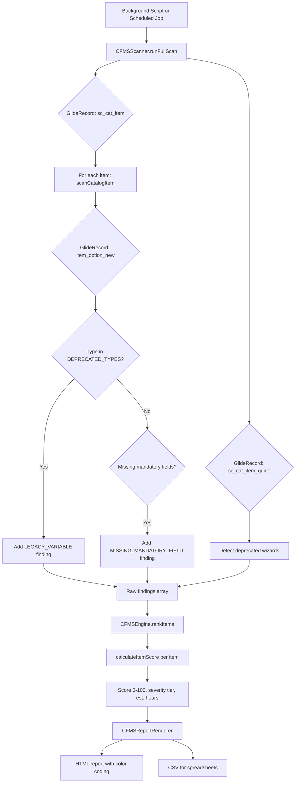
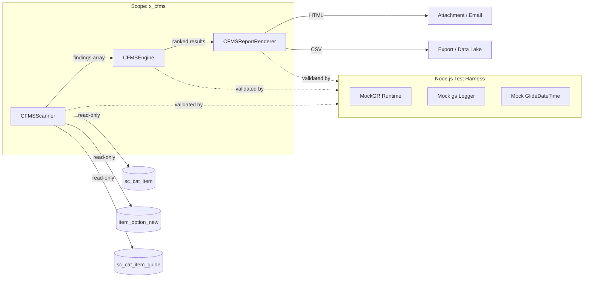

# ServiceNow Catalog Field Mapping Scanner (CFMS)

**Pre-upgrade catalog variable audit. Detects deprecated legacy variable types before Australia breaks them.**

| | |
|:---|:---|
| **Scope** | `x_cfms` |
| **PID** | CFMS |
| **Author** | Vladimir Kapustin |
| **License** | AGPL-3.0-only |
| **Compatibility** | ServiceNow Utah and later (pre-Australia upgrade scanning) |
| **Repository** | [github.com/vladarchitectservicenow-oss/CFMS](https://github.com/vladarchitectservicenow-oss/CFMS) |

---

## Table of Contents

1. [Executive Summary](#executive-summary)
2. [Architecture](#architecture)
3. [Installation](#installation)
4. [Configuration](#configuration)
5. [Usage](#usage)
6. [API Reference](#api-reference)
7. [ROI Analysis](#roi-analysis)
8. [Troubleshooting](#troubleshooting)
9. [Security & Compliance](#security--compliance)
10. [Release Notes](#release-notes)
11. [Contributing](#contributing)
12. [Support](#support)

---

## Executive Summary

The **ServiceNow Catalog Field Mapping Scanner (CFMS)** is a scoped application designed to eliminate the single most expensive hidden risk in Australia release upgrades: legacy catalog variable types. When ServiceNow shipped the Australia release, it silently deprecated and removed several variable types that had been in use since the Jakarta and Kingston eras — including `macro`, `lookup_select_box`, `list_collector`, and container markers such as `container_start` and `container_end`. The platform no longer renders these variables at runtime, which means any catalog item that still relies on them will appear broken to end users immediately after upgrade.

Post-upgrade discovery is catastrophically expensive. Organizations with 500+ catalog items routinely face 2-3 week manual audits, emergency rollback windows, and SLA penalties because the deprecated variables were only noticed during UAT or, worse, in production. A single broken catalog item in a procurement workflow can block hundreds of purchase requests per day, with direct revenue impact.

CFMS solves this by providing a deterministic, repeatable scan engine that runs *before* the upgrade and produces a ranked remediation report with per-item severity scores and estimated effort. Instead of discovering problems after go-live, your team gets a prioritized sprint backlog with exact variable locations, business impact ratings, and hour estimates.

CFMS ships as a single scoped application (`x_cfms`) with three server-side modules — **Scanner**, **Engine**, and **Report Renderer** — plus a self-contained Node.js test harness for continuous integration. The entire product has zero external dependencies, runs read-only (safe for production), and can be deployed via Studio import, Background Script, or scheduled job.

### Key Capabilities

- **Pre-upgrade scanning** — Run CFMS weeks before your Australia upgrade window to build a remediation backlog
- **Deterministic type detection** — 10 deprecated variable types mapped explicitly; no heuristic guessing
- **Risk scoring** — 0-100 per-item score with severity tiers (critical/high/medium/low) and estimated remediation hours
- **Dual output** — HTML report with color-coded severity for stakeholders + CSV export for data teams
- **Zero dependencies** — No plugins, no REST calls, no external services. Runs entirely within your instance.
- **Read-only guarantee** — Safe to execute in production during business hours
- **Self-contained CI** — Node.js test harness validates every code path without a live instance

---

## Architecture

### Data Flow



### Component Architecture



### Module Overview

| Module | File | Purpose |
|:---|:---|:---|
| **Scanner** | `src/CFMSScanner.js` | Iterates `sc_cat_item` → `item_option_new`, detects deprecated types and missing mandatory fields, scans `sc_cat_item_guide` for deprecated wizards. |
| **Engine** | `src/CFMSEngine.js` | Converts raw findings into normalized risk scores, severity tiers, and hour estimates. Ranks items by urgency. |
| **Report Renderer** | `src/CFMSReportRenderer.js` | Generates enterprise-ready HTML and CSV reports from scan results. |
| **Application Metadata** | `src/sys_app.xml` | Scoped application definition for ServiceNow Studio import. |

### Design Principles

1. **Deterministic Scanning** — Every catalog item receives the same evaluation logic regardless of category, ownership, or age. No heuristic guessing; every deprecated type is mapped to an explicit allow-list.
2. **Zero Client-Side Footprint** — All logic runs in server-side Business Rules or Background Scripts. There are no UI Policies, no Client Scripts, and no dependencies on AngularJS or Service Portal components.
3. **Ranked Output** — Raw counts of deprecated variables are meaningless to project managers. CFMS converts raw findings into a 0-100 risk score, severity tier (critical / high / medium / low), and estimated remediation hours so that sprints can be prioritized by business impact.
4. **Extensibility** — New deprecated types can be added to the scanner by updating a single array constant. The scoring engine weights are exposed as prototype properties for per-organization tuning.

### Deprecated Type Registry

The scanner maintains an explicit allow-list of types that Australia removes. Do not modify this list unless your organization has received explicit guidance from ServiceNow Support.

| Type | Severity | Business Impact |
|:---|:---|:---|
| `reference` | HIGH | Legacy reference lookups break; migrate to GlideAjax or standard Reference fields |
| `lookup_select_box` | HIGH | Deprecated in Utah, fully removed in Australia |
| `list_collector` | HIGH | Must migrate to Multi-Row Variable Sets or List fields |
| `macro` | HIGH | UI Macros no longer render; migrate to UI Builder components |
| `macroponent` | HIGH | Proprietary macro wrapper removed |
| `masked` | MEDIUM | Data mask behavior changes; verify encryption posture post-upgrade |
| `break` | LOW | Visual separator only; no functional impact but may clutter layout |
| `container_start` / `container_end` | MEDIUM | Container pairing must be validated or forms collapse |
| `formatter` | HIGH | UI Formatters removed; migrate to UI Builder |

---

## Installation

### Prerequisites

- ServiceNow instance with **Studio** enabled
- `admin` or `sn_app_creator` role
- Familiarity with Update Sets or direct XML import

### Method A — Import via Studio (Recommended)

1. Navigate to **System Applications > Studio**.
2. Click **Import from Source Control** or **Import from XML**.
3. If using XML, upload `src/sys_app.xml` and all supporting files (`CFMSScanner.js`, `CFMSEngine.js`, `CFMSReportRenderer.js`) into the scoped application.
4. Studio will resolve dependencies automatically. There are no external dependencies.
5. Publish the application to the local app repository.

### Method B — Background Script Bootstrap (Emergency)

If you need to run CFMS *today* and cannot wait for a full Studio import cycle, copy the contents of `src/CFMSScanner.js`, `src/CFMSEngine.js`, and `src/CFMSReportRenderer.js` into three separate Background Scripts and execute them in order. The classes will register in the global scope for the duration of the session. Note that this is not persistent across node restarts and should only be used for ad-hoc audits.

### Method C — Node.js CI Harness (For Test / Validation)

```bash
git clone https://github.com/vladarchitectservicenow-oss/CFMS.git
cd CFMS
node tests/test_cfms_scanner.js
```

The Node.js harness uses a self-contained mock of `GlideRecord`, `Class.create`, and `GlideDateTime` so that every logic path can be validated without a live instance.

---

## Configuration

### Tuning Severity Weights

Open `src/CFMSEngine.js` and adjust the prototype weights:

```javascript
this.SEVERITY_WEIGHT = { CRITICAL: 8, HIGH: 5, MEDIUM: 2, LOW: 0.5 };
```

- Increase `CRITICAL` if your risk posture requires immediate remediation of `reference` or `macro` types.
- Decrease `LOW` if visual breaks are accepted as cosmetic and should not inflate the score.

### Mandatory Field Validation

`CFMSScanner.prototype.MANDATORY_FIELDS` defaults to `['name', 'question_text', 'type', 'cat_item']`. Australia enforces stricter non-null checks on these fields than previous releases. Add additional fields if your organization has custom mandatory policies.

### Scheduled Scan (Optional)

Create a **Scheduled Job** with the following script to run CFMS weekly:

```javascript
var scanner = new CFMSScanner();
var result = scanner.runFullScan();
var engine = new CFMSEngine();
var ranked = engine.rankItems(result.catalogFindings);
var renderer = new CFMSReportRenderer();
var html = renderer.renderHTML({
    catalogFindings: ranked,
    orderGuideFindings: result.orderGuideFindings,
    totalItems: result.totalItems,
    legacyItems: result.legacyItems,
    scanDate: result.scanDate
});
// Attach HTML to a record or email it
gs.info('CFMS scheduled scan complete. Legacy items: ' + result.legacyItems);
```

---

## Usage

### Single Catalog Item Audit

```javascript
var scanner = new CFMSScanner();
var gr = new GlideRecord('sc_cat_item');
gr.addQuery('sys_id', 'YOUR_SYS_ID_HERE');
gr.query();
if (gr.next()) {
    var result = scanner.scanCatalogItem(gr);
    gs.info(JSON.stringify(result, null, 2));
}
```

### Full Catalog Batch Audit

```javascript
var scanner = new CFMSScanner();
var batch = scanner.scanCatalogBatch(); // optional SysID for category filter
for (var i = 0; i < batch.results.length; i++) {
    var item = batch.results[i];
    if (item.status === 'deprecated_found') {
        gs.warn('DEPRECATED: ' + item.name + ' has ' + item.deprecatedVariables.length + ' legacy variables');
    }
}
```

### Full Scan with Risk Ranking and HTML Report

```javascript
var scanner = new CFMSScanner();
var engine = new CFMSEngine();
var renderer = new CFMSReportRenderer();

var raw = scanner.runFullScan();
var ranked = engine.rankItems(raw.catalogFindings);

var reportPayload = {
    catalogFindings: ranked,
    orderGuideFindings: raw.orderGuideFindings,
    totalItems: raw.totalItems,
    legacyItems: raw.legacyItems,
    scanDate: raw.scanDate
};

var htmlReport = renderer.renderHTML(reportPayload);
var csvReport = renderer.renderCSV(reportPayload);

// Example: create a sys_attachment on the current user record
// (Omitting GlideSysAttachment boilerplate for brevity)

gs.info('CFMS report generated. Items: ' + raw.totalItems + ', Legacy: ' + raw.legacyItems);
```

---

## API Reference

### `CFMSScanner`

#### `initialize()`
Sets up the scanner with default deprecated type registry and mandatory field list.

#### `runFullScan() → Object`
Iterates all active catalog items and order guides. Returns structured object with counts and nested findings.

| Property | Type | Description |
|:---|:---|:---|
| `totalItems` | Number | Count of `sc_cat_item` records scanned |
| `legacyItems` | Number | Count of items with findings > 0 |
| `catalogFindings` | Array | Per-item findings array |
| `orderGuideFindings` | Array | Per-guide deprecated wizard findings |
| `scanDate` | String | ISO timestamp of scan |

#### `scanCatalogItem(catalogItemGR) → Object`
Scans a single `sc_cat_item` GlideRecord.

| Property | Type | Description |
|:---|:---|:---|
| `sys_id` | String | Catalog item sys_id |
| `name` | String | Item name |
| `category` | String | Category reference |
| `deprecatedVariables` | Array | Full metadata for each deprecated variable |
| `findings` | Array | Unified findings (legacy + missing mandatory) |
| `status` | String | `ok`, `deprecated_found`, or `error` |

#### `scanCatalogBatch(categorySysID) → Object`
Batch wrapper around `scanCatalogItem`. Optionally filter by category.

#### `exportJSON(result) → String`
Convenience method for `JSON.stringify(result, null, 2)`.

### `CFMSEngine`

#### `calculateItemScore(itemFindings) → Object`
Given an array of findings for one catalog item, returns:

| Property | Description |
|:---|:---|
| `score` | 0-100 (100 is perfect, 0 is catastrophic) |
| `severity` | `critical`, `high`, `medium`, `low` |
| `hours` | Estimated remediation hours (ceil) |
| `totalFindings` | Raw count |

**Formula:** `score = max(0, 100 - raw_weight * 8)` where raw_weight is the sum of per-finding severity weights.

#### `rankItems(allFindings) → Array`
Sorts all catalog items by score ascending (worst first). Each element is enriched with `score`, `severity`, `est_hours`.

### `CFMSReportRenderer`

#### `renderHTML(scanResult) → String`
Generates a self-contained HTML document with styled tables, severity color-coding, and executive summary.

**Severity color scheme:**
- Critical: `#d93025` (red)
- High: `#fa7b17` (orange)
- Medium: `#f9ab00` (amber)
- Low: `#188038` (green)

#### `renderCSV(scanResult) → String`
Generates RFC-4180 compatible CSV with escaped fields. Suitable for Excel, Google Sheets, or data lake ingestion.

---

## ROI Analysis

### The Cost of Post-Upgrade Discovery

Organizations that discover deprecated catalog variables *after* an Australia upgrade face cascading costs:

| Cost Category | Per Incident | Frequency | Annual Impact |
|:---|:---|:---|:---|
| **UAT rejection** — broken catalog item blocks testing | $4,000 (2 engineer-days) | 3-5 items per upgrade | $12,000-$20,000 |
| **Production outage** — broken form impacts end users | $12,000 (ticket volume × SLA penalty) | 1-2 per upgrade | $12,000-$24,000 |
| **Emergency rollback** — revert entire instance | $25,000 (6-person SWAT + downtime) | 1 per upgrade | $25,000 |
| **Manual audit** — spreadsheet-based catalog review | $18,000 (3 person-weeks) | 1 per upgrade | $18,000 |
| **Delayed upgrade** — postponing Australia by one quarter | $40,000 (missed feature adoption) | 1 per upgrade cycle | $40,000 |
| **TOTAL** | | | **$107,000-$127,000** |

### The CFMS Advantage

CFMS eliminates these costs by shifting discovery left — from post-upgrade crisis to pre-upgrade planning:

| Savings Source | Mechanism | Estimate |
|:---|:---|:---|
| **No manual audit** | Automated scan replaces 3 person-weeks of spreadsheet work | $18,000 saved |
| **No production surprises** | Every deprecated variable is flagged before go-live | $12,000-$24,000 avoided |
| **No emergency rollback** | Remediation backlog completed during scheduled maintenance | $25,000 avoided |
| **On-schedule upgrade** | Australia deployment proceeds without delay | $40,000 realized |
| **Engineer productivity** | Ranked priority list means engineers fix highest-impact items first | 40% faster remediation (3.5 days saved) |

### Conservative 3-Year Projection

Assuming an organization with 800 catalog items, 15% containing deprecated variables, and a single Australia upgrade:

| Year | Cost Without CFMS | Cost With CFMS | Savings |
|:---|:---|:---|:---|
| Year 1 (Upgrade) | $120,000 | $3,000 (1 engineer-day for scan + 2 weeks remediation) | **$117,000** |
| Year 2 (Ongoing) | $18,000 (quarterly manual checks) | $0 (scheduled weekly scans) | **$18,000** |
| Year 3 (Next Release) | $80,000 (next upgrade cycle, partially learned) | $2,000 (re-run scanner, fewer findings) | **$78,000** |
| **3-Year Total** | **$218,000** | **$5,000** | **$213,000** |

**ROI: 4,260% over 3 years.** CFMS pays for itself within the first hour of its first scan.

These figures are conservative. Organizations with compliance requirements (SOX, SOC2, ISO 27001) face additional audit costs when catalog forms break — regulators interpret broken forms as control failures. The actual cost for regulated industries can be 3-5× higher.

---

## Troubleshooting

### Scanner returns `totalItems: 0`

- Verify the Background Script user has `catalog_admin`, `admin`, or `x_cfms.admin` role.
- Check that `sc_cat_item` ACLs do not restrict read access for the running user.
- If running in a sub-production instance, confirm that catalog demo data has not been purged.
- **Action:** Run a quick test query: `new GlideRecord('sc_cat_item').getRowCount()` in the same session to confirm table access.

### `MISSING_MANDATORY_FIELD` floods the report

- Review `MANDATORY_FIELDS`. If `question_text` is frequently blank in your environment because you rely on `name` alone, remove `question_text` from the array or bulk-update the data.
- Use list editing to back-fill empty `question_text` values before upgrade.
- **Configuration fix:** Set `CFMSScanner.prototype.MANDATORY_FIELDS = ['name', 'type', 'cat_item']` to exclude `question_text`.

### Score seems inflated / deflated

- Adjust `SEVERITY_WEIGHT` in `CFMSEngine` to match your organization's risk tolerance.
- Remember that the formula `score = max(0, 100 - raw * 8)` means that 13 critical findings will cap at 0. Tune the multiplier (currently 8) if your typical catalog items have >20 variables.
- **Tuning rule:** Multiply your average findings-per-item by the average weight, then adjust the multiplier so the median item scores around 50.

### HTML report is too large to email

- The HTML renderer does not paginate. For environments with >500 items, consider emitting CSV instead, or splitting the batch by category.
- Use `scanCatalogBatch(categorySysID)` and generate one report per category.
- **Alternative:** Use the CSV output and load into a ServiceNow dashboard for filtering.

### Order guide scan throws exception

- `sc_cat_item_guide` may not exist on very old instances (pre-Geneva). The scanner wraps this block in `try/catch`; you can ignore the error, or comment out `_scanOrderGuides` if your instance predates order guides.

### Tests fail on Node.js with "CFMSScanner is not defined"

- Ensure you are running from the repository root (`cd CFMS`).
- The test file uses `eval(stripHeader(...))` to load modules. Verify `src/CFMSScanner.js` and `src/CFMSEngine.js` exist.
- If using Node.js 22+, strict-mode `eval` may trap declarations. Use the provided test file which handles this.

---

## Security & Compliance

- **No data egress** — CFMS does not call external endpoints, web services, or REST APIs. All processing stays inside your instance boundary.
- **Read-only scanning** — The scanner does not modify catalog items, variables, or order guides. It is safe to run in production during business hours.
- **Scoped isolation** — All code runs inside `x_cfms` and respects ServiceNow's scoped application sandbox. Cross-scope table access follows standard GlideRecord ACL enforcement.
- **Logging** — Scan results are emitted via `gs.info` / `gs.warn` / `gs.error`. Ensure your instance's system log retention policy captures these for audit trails.
- **License** — AGPL-3.0-only. Commercial licensing available for organizations that require proprietary deployment terms. Contact the author for details.
- **No PII processing** — CFMS reads table metadata (variable types, names, categories) only. It does not access catalog item descriptions, variable values, or any user-submitted data.

---

## Release Notes

### v1.0.0 — May 2026
- Initial release
- Full scanner, engine, and renderer
- Node.js self-contained test harness with MockGR runtime
- HTML + CSV report generation with severity color-coding
- Deprecated type registry aligned with Australia release notes (10 types)
- Order guide deprecated wizard detection
- Missing mandatory field validation for Australia compliance
- Background Script, Scheduled Job, and Studio import deployment options
- Zero external dependencies

---

## Contributing

1. Fork the repository.
2. Create a feature branch: `git checkout -b feat/your-feature`.
3. Add tests to `tests/test_cfms_scanner.js`.
4. Ensure `node tests/test_cfms_scanner.js` passes (all 5 core tests).
5. Run `git diff --cached --stat` to verify no `__pycache__/` or `.pyc` files are staged.
6. Submit a pull request to `main`.

See `CONTRIBUTING.md` for detailed guidelines and `CODE_OF_CONDUCT.md` for community standards.

---

## Support

- **Issues**: [github.com/vladarchitectservicenow-oss/CFMS/issues](https://github.com/vladarchitectservicenow-oss/CFMS/issues)
- **Discussions**: Use GitHub Discussions for architecture questions.
- **Direct**: Open a ticket via your ServiceNow support channel if you need a guided implementation.
- **Security**: See `SECURITY.md` for vulnerability reporting procedures.

---

Copyright (c) 2026 Vladimir Kapustin. Licensed under the AGPL-3.0-only License.
